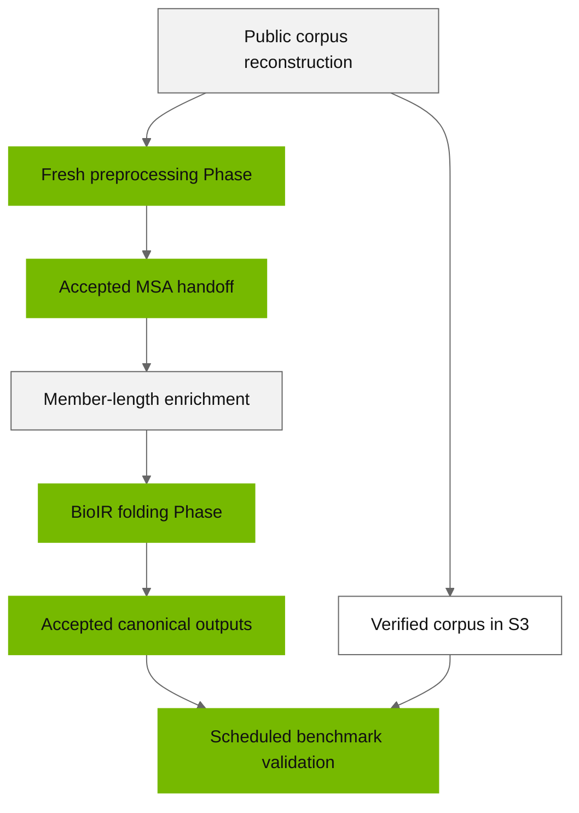

# Run the public BioIR folding benchmark

This walkthrough connects public corpus reconstruction, fresh MSA generation,
BioIR folding, Phase acceptance, and benchmark validation. It describes the
interfaces in this checkout. It is an operator workflow, not a one-command
benchmark runner: site configuration, verified input records, and some evidence
transfers must be supplied by the operator.

The cohort is [pdb-temporal-2022-2025-v1](pdb-temporal-2022-2025-v1/README.md):
1,000 targets containing 750 monomers, 150 dimers, 50 trimers, and 50 tetramers,
with 391,180 residues after counting every chain copy. Read the
[measurement methodology](methodology.md) before deciding which stages to time.



## Before running commands

Run `bsppctl` on the workstation from an installed, clean, committed checkout;
follow the [installation instructions](../guides/installation.md). Corpus
reconstruction also needs PyArrow, as described in the
[corpus guide](pdb-temporal-2022-2025-v1/README.md#reconstruct-the-benchmark-with-the-existing-wrapper).
Cluster work runs through Slurm and the supplied container entrypoints.

Commands below are **templates** until you bind their shell variables to real
values. No example identifier, digest, timestamp, profile, or path establishes
artifact identity. Use new output directories outside the source checkout and
retain each command's stdout, stderr, exit status, and UTC execution interval.
Commands that submit work are identified explicitly.

| Binding | Meaning |
| --- | --- |
| `SOURCE_REPO`, `PROFILE_CONFIG`, `AUTHORITY_ROOT` | Clean local source checkout, operator-authored profile file, and durable local Phase authority directory. |
| `CORPUS`, `BENCHMARK_FASTA` | New local corpus directory and a separate `.fa` input file. |
| `PREPROCESS_PROFILE`, `FOLD_PROFILE`, `VALIDATION_PROFILE` | Actual profile keys; they may differ by image, scheduling requirements, and mounts. |
| `PREPROCESS_PLAN`, `FOLD_PLAN` | Fully authored Phase Plan files with genuine input authority. |
| `PREPROCESS_PHASE`, `FOLD_PHASE` | Opaque IDs returned by the respective materialization commands. |
| `PREPROCESS_HANDOFF`, `CLUSTER_PREPROCESS_HANDOFF` | Verified local finalization copy and original cluster-resident preprocessing handoff, respectively. |
| Evidence and cluster-path variables used below | Actual paths derived from the materialized RunSpec, Runtime output, or validated handoff; never guessed IDs or copied example values. |

Use the existing [Cluster Profile](../../skills/examples/run-plans/cluster-profile.yaml),
[preprocessing Phase Plan](../../skills/examples/run-plans/preprocessing-phase-plan.yaml),
and [folding Phase Plan](../../skills/examples/run-plans/folding-phase-plan.yaml)
as the single field-by-field reference. Those files deliberately contain
non-runnable examples. The [cluster configuration guide](../guides/cluster-configuration.md)
and [configuration reference](../reference/configuration.md) explain their
ownership and input contracts. The [CLI reference](../reference/bsppctl.md)
and [Phase lifecycle guide](../guides/phase-lifecycle.md) describe the commands
and evidence boundaries used below.

## 1. Reconstruct and verify the corpus

The following workstation command downloads public RCSB data without S3 access:

```bash
bsppctl prepare-benchmark \
  --spec docs/benchmarks/pdb-temporal-2022-2025-v1/benchmark-spec.json \
  --reconstruct docs/benchmarks/pdb-temporal-2022-2025-v1/reconstruction-targets.jsonl \
  --output "$CORPUS" --workers 4
```

Follow the corpus guide's checksum and fingerprint checks before using the
result. Preserve the generated manifest, normalized reference structures,
`targets.jsonl`, and `validation-suite-n1000.json`. A PDB ID alone does not
preserve assembly expansion, chain ordering, or repeated chains.

The preprocessing parser requires a `.fa` suffix. Make a byte-identical copy
outside the corpus, without changing the checked corpus files:

```bash
cp -- "$CORPUS/targets.fasta" "$BENCHMARK_FASTA"
cmp -- "$CORPUS/targets.fasta" "$BENCHMARK_FASTA"
```

`BENCHMARK_FASTA` must end in `.fa`. Stage its exact bytes at the cluster-visible
input path selected in the preprocessing Plan and verify the transfer. Keep
all target IDs and expanded chain sequences intact.

## 2. Prepare images, databases, and checkpoints

Use the [container workflow](../guides/containers.md) and the
[BioIR image guide](../../containers/folding/bioir/README.md). This workflow
needs the preprocessing image, folding Runtime image, and BioIR kernel image.
The later validation step also needs a validation-capable image, such as the
shipped postprocessing image, selected separately in `VALIDATION_PROFILE`.
The repository-owned build/publish/import command families are:

```bash
containers/scripts/push.sh preprocessing
containers/scripts/push.sh folding runtime
containers/scripts/push.sh folding bioir
containers/scripts/push.sh postprocessing
```

These workstation commands build and publish images to the operator-configured
registry. Follow the container guide to import each immutable image in a
scheduled job with `containers/scripts/pull-sqsh.sh`. Bind actual build records,
OCI digests, imported SquashFS hashes, source/wheel identities, and paths in the
profiles. A successful CPU composition smoke does not prove CUDA initialization,
checkpoint loading, or inference on the target GPU.

Provide the supported primary and metagenomic sequence databases through a
real Database Set declaration. Inventory the complete declared source tree,
including hidden files and metadata; a filename-prefix listing is insufficient.
The cluster-side provisioning interface is this **Runtime command inside a
scheduled preprocessing-container job**, with the declared source and output
paths mounted appropriately:

```bash
bspp-orchestration-runtime preprocessing database-set provision \
  --declaration "$DATABASE_DECLARATION" \
  --manifest-root "$DATABASE_MANIFEST_ROOT" \
  --write-evidence "$DATABASE_PROVISIONING_EVIDENCE"
```

Retain the resulting immutable Database Source Manifest and provisioning
evidence. Provisioning does not itself prove a successful MSA search. Configure
the declared Database Set identity, access policy, read-only source mount, and,
when staging is selected, cache filesystem, effective user, capacity reserve,
and lock settings. The [placement architecture](../preprocessing-database-placement-architecture.md)
and [preprocessing image guide](../../containers/preprocessing/README.md)
describe the checks. A local staging cache must satisfy the actual Runtime
filesystem and ownership contract; spare bytes alone are insufficient.

For this mixed cohort, author the explicit BioIR
`expanded-chain-count-v1` model policy: one expanded chain uses
`openfold2_ptm_1`; two or more use `alphafold2_multimer_1`. Obtain the compatible
checkpoints from their providers, record provenance and license information,
and measure their SHA-256 values and sizes. Configure
`bioir_monomer_checkpoint` and `bioir_checkpoint` with exact read-only mounts.
Omitting the policy preserves historical multimer-only behavior and is not a
mixed-cohort configuration. Changing policy or checkpoint identity requires
fresh scientific authority.

## 3. Qualify and run fresh preprocessing

First stage the provenance Source Bundle from the clean checkout:

```bash
bsppctl --config "$PROFILE_CONFIG" runtime preprocessing stage-source-bundle \
  --profile "$PREPROCESS_PROFILE" --source-repo "$SOURCE_REPO" \
  --build-dir "$SOURCE_BUNDLE_BUILD_DIR"
```

Pin the returned source commit and Source Bundle hash in the profile's
`preprocessing_runtime` block alongside the measured image identities. Then
submit the actual qualification and resolve its terminal result:

```bash
bsppctl --config "$PROFILE_CONFIG" runtime preprocessing qualify \
  --profile "$PREPROCESS_PROFILE" --source-repo "$SOURCE_REPO"
bsppctl --config "$PROFILE_CONFIG" runtime preprocessing resolve \
  --profile "$PREPROCESS_PROFILE" --source-repo "$SOURCE_REPO"
```

Qualification is a scheduled composition/tool check. It is not acceptance of
the scientific MSA run. Proceed only with a current successful qualification
for the actual profile/source/image tuple.

Author the preprocessing Plan from the verified `.fa` input, real Database Set,
and current Contract planning records. This guide uses one fresh chunk covering
the full cohort; splitting into more preprocessing Phases is a separate operator
choice whose lineage must also be retained. Use the template's scientific
schema version 3, including its paired-row-preserving filter policy. Keep the
parser's validated PDB naming policy rather than applying unrelated identifier
settings. Derive execution vectors from the Contract APIs; do not invent
artifact-location IDs or replace example digests with arbitrary strings.

```bash
bsppctl --config "$PROFILE_CONFIG" phase materialize "$PREPROCESS_PLAN" \
  --authority-root "$AUTHORITY_ROOT" --source-repo "$SOURCE_REPO"
```

Record `PREPROCESS_PHASE` from the returned JSON and inspect its immutable
RunSpec, input pins, paths, mounts, and resources. Then submit once:

```bash
bsppctl --config "$PROFILE_CONFIG" phase submit "$PREPROCESS_PHASE" \
  --authority-root "$AUTHORITY_ROOT"
bsppctl --config "$PROFILE_CONFIG" phase status "$PREPROCESS_PHASE" \
  --authority-root "$AUTHORITY_ROOT" --format json
bsppctl --config "$PROFILE_CONFIG" phase resume "$PREPROCESS_PHASE" \
  --authority-root "$AUTHORITY_ROOT"
```

`status` observes; `resume` performs one bounded reconciliation. Repeat
observation/reconciliation as needed until the genuine assigned action is
terminal. Preserve failures and scheduler restart history; a successful search
log alone does not establish successful placement, publication, or acceptance.

## 4. Accept and enrich the real MSA handoff

Preprocessing does not have a `phase evidence fetch` route in this checkout.
Transfer its original small metadata records using the site's file-transfer
mechanism, verify stable source/destination bytes, and preserve this exact
four-file handoff layout:

```text
PREPROCESS_HANDOFF/
  chunks/<actual-chunk-name-without-.fa>.json
  artifact-set.json
  artifact-location.json
  content-validation.json
```

Keep the action evidence separately; extra files or symlinks inside this
handoff are rejected. The RunSpec and actual Runtime outputs determine the
source paths. Keep both the `.tar` and `.tar.lz4` payloads and their recorded
hashes; transferring metadata does not transfer the alignments.

`PREPROCESS_SCHEDULER_EVIDENCE` must be a genuine
`ProvidedSuccessfulSchedulerEvidence` record projected from the matching
successful terminal event recorded by public `phase resume`. Bind its Phase,
Attempt, RunSpec digest, action/job ID, observation time, source, state, and
exact exit code. Use the current Contract type to validate this projection.
The `phase evidence export-scheduler` CLI is postprocessing-only; do not use it
for preprocessing or folding, and do not hand-author a claimed success.

```bash
bsppctl --config "$PROFILE_CONFIG" phase finalize "$PREPROCESS_PHASE" \
  --authority-root "$AUTHORITY_ROOT" \
  --scheduler-evidence "$PREPROCESS_SCHEDULER_EVIDENCE" \
  --action-evidence "$PREPROCESS_ACTION_EVIDENCE" \
  --handoff "$PREPROCESS_HANDOFF"
```

Require an accepted receipt bound to this actual attempt. The current
preprocessing producer does not populate `member_lengths` in the artifact-set
manifest. Packed folding needs these lengths, so even freshly generated MSAs
use the existing public enrichment command. `CLUSTER_PREPROCESS_HANDOFF` must
name the original verified four-file handoff on the cluster selected by
`FOLD_PROFILE`; it is not the local `PREPROCESS_HANDOFF` copy used above:

```bash
bsppctl --config "$PROFILE_CONFIG" legacy-msa-import \
  --handoff-root "$CLUSTER_PREPROCESS_HANDOFF" \
  --output-dir "$CLUSTER_ENRICHMENT_OUTPUT" \
  --profile "$FOLD_PROFILE"
```

This submits one scheduled Runtime job. Retain its successful terminal evidence
and CLI result, which contains the job ID, artifact IDs, and member lengths.
The CLI does not return the original enriched record bytes. Transfer
`artifact-set.json`, `artifact-location.json`, and `content-validation.json`
from `CLUSTER_ENRICHMENT_OUTPUT` into a fresh local directory, checking stable
source/destination bytes. Enrichment creates a new artifact-set identity without
rewriting the original producer handoff or alignment payloads. Validate those
three enriched records with the unchanged original chunk manifest; never patch
the old artifact-set ID in place.

For a local bundled input, materialization verifies local payload bytes and
Runtime needs the declared paths on the execution filesystem. Supply genuine,
verified replicas at those paths and appropriate container mounts; workstation
path existence alone proves nothing about compute-node visibility. Cross-cluster
reuse must preserve exact payload/member identities and be disclosed as shared
MSA preparation. A fresh end-to-end comparison generates fresh MSAs for each
run; it may reuse immutable reference database and checkpoint assets.

## 5. Author and run the BioIR folding Phase

Bind the real enriched MSA set and location, the matching enriched root
manifest, the unchanged original chunk manifest records, ordered source
identifiers, and expanded member lengths in the canonical folding Plan shape. Select `backend: bioir`, the explicit mixed model policy, and
`evidence_profile: artifact-backed-v2`. The latter requires packed BioIR and
keeps large original score arrays on the execution filesystem.

For a two-node experiment, configure the supported typed topology with
`nodes: 2`, a site-appropriate `tasks_per_node`, `gpus_per_task: 1`, and
`max_parallel: 2`. Do not also set legacy `gres` or `array` strings. This creates
two independent one-node array elements; it does not reserve an atomic node pair
or guarantee concurrent start. Use a homogeneous GPU pool and retain actual
allocation/device evidence. See [methodology](methodology.md#prove-parallelism).
The non-fold actions use the folding Runtime image; only the fold action uses
the BioIR image selected through `folding_backend_images`.

```bash
bsppctl --config "$PROFILE_CONFIG" phase materialize "$FOLD_PLAN" \
  --authority-root "$AUTHORITY_ROOT" --source-repo "$SOURCE_REPO"
```

Record the returned `FOLD_PHASE`, inspect the actual RunSpec and rank projection,
and verify image/checkpoint/input bindings and the rendered scheduling shape.
Then drive the public lifecycle:

```bash
bsppctl --config "$PROFILE_CONFIG" phase submit "$FOLD_PHASE" \
  --authority-root "$AUTHORITY_ROOT"
bsppctl --config "$PROFILE_CONFIG" phase status "$FOLD_PHASE" \
  --authority-root "$AUTHORITY_ROOT" --format json
bsppctl --config "$PROFILE_CONFIG" phase resume "$FOLD_PHASE" \
  --authority-root "$AUTHORITY_ROOT"
```

The five actions are `msa-flatten`, `split`, `preprocess`, `fold`, and
`canonical-pair`; use their actual IDs and assigned jobs from authority.
Preserve terminal accounting for both array elements, restart counts, and
complete original fold logs before scheduler retention expires. Do not resubmit
on a lost response without first reconciling actual authority and assignment.

After all actions have genuinely succeeded, fetch and accept the indexed
artifact-backed handoff:

```bash
bsppctl --config "$PROFILE_CONFIG" phase evidence fetch "$FOLD_PHASE" \
  --authority-root "$AUTHORITY_ROOT" --destination "$FOLD_HANDOFF"
bsppctl --config "$PROFILE_CONFIG" phase finalize "$FOLD_PHASE" \
  --authority-root "$AUTHORITY_ROOT" \
  --scheduler-evidence "$FOLD_SCHEDULER_EVIDENCE" \
  --action-evidence "$FOLD_HANDOFF/$CANONICAL_ACTION_ID/action-evidence.json" \
  --handoff "$FOLD_HANDOFF"
```

Here `FOLD_SCHEDULER_EVIDENCE` is the validated projection of the actual
canonical-action successful terminal event, after `resume` has recorded the
entire successful action graph and exact array-element closure. As above, its
production is an explicit operator/API step, not a folding scheduler-export CLI.
Finalization seals an attempt-bound receipt; it neither transfers prediction
files nor publishes them to S3. Audit original structure/score bytes separately
when reporting file integrity.

## 6. Run the benchmark validation worker

**Public RCSB reconstruction does not remove the current validation transport
requirement.** `bsppctl validate-run` requires a corpus S3 prefix and a profile
with `postprocessing_credential_mounts` pointing to both cluster-visible AWS
shared credentials and config files. There is no local-corpus switch in this
checkout. If that storage configuration is unavailable, report validation as
not run; do not equate Phase acceptance with reference validation.

Set `VALIDATION_PROFILE.paths.image` to the imported postprocessing image, or
another image verified to provide the benchmark validator and its full Runtime
dependencies, including PyArrow and NumPy. This command uses `paths.image`
directly; it does not select a folding backend override. The small
`folding-runtime` image is insufficient because it omits PyArrow. Keep the
validation image's source provenance consistent with the intended validator.

Publish the complete verified corpus, including its manifest, to an authorized
S3 prefix using the site's established data-transfer procedure. Preserve the
fingerprint and verify the uploaded bytes. Stage the matching full-cohort suite
and actual canonical index on the cluster. The following paths must be absolute
cluster-visible paths, even though the command runs on the workstation:

```bash
bsppctl --config "$PROFILE_CONFIG" validate-run \
  --run-dir "$CLUSTER_COMPLETED_RUN" \
  --suite "$CLUSTER_VALIDATION_SUITE" \
  --index "$CLUSTER_CANONICAL_INDEX" \
  --corpus "$CORPUS_S3_PREFIX" \
  --fingerprint "$CORPUS_FINGERPRINT" \
  --profile "$VALIDATION_PROFILE" \
  --output-dir "$CLUSTER_VALIDATION_OUTPUT"
```

If required, add `--aws-profile "$AWS_PROFILE_NAME"` to select an existing
shared profile. Keep credential contents outside plans, reports, and logs.
The command schedules a CPU worker, recursively fetches the corpus, verifies
checksums and fingerprint, and returns bounded summary data. Retain the
cluster-resident `summary.json` and `validation.parquet` plus command and job
evidence. A nonaccepted result exits nonzero.

This suite checks composition and validity, including finite confidence arrays
and reference C-alpha coverage. C-alpha RMSD is reported but is not an accuracy
pass threshold. Keep Phase acceptance, original-file integrity, suite acceptance,
and any separately defined scientific accuracy criteria distinct in the
[report](reporting.md).

## Implementation references

These links locate the current boundaries when authoring or reviewing a run:

- [Control CLI](../../packages/orchestration-control/src/bspp/orchestration/control/cli.py): exact command groups and options.
- [Phase finalization](../../packages/orchestration-control/src/bspp/orchestration/control/phase_finalization.py): typed scheduler/action/handoff checks.
- [Preprocessing handoff contracts](../../packages/orchestration-contract/src/bspp/orchestration/contract/preprocessing_handoff.py): original and enriched artifact identities.
- [Benchmark submission](../../packages/orchestration-control/src/bspp/orchestration/control/folding_benchmark_submit.py): required S3 credential mounts and cluster paths.
- [Runtime validation](../../packages/orchestration-runtime/src/bspp/orchestration/runtime/folding/benchmark/validation.py): actual suite checks and reported metrics.
