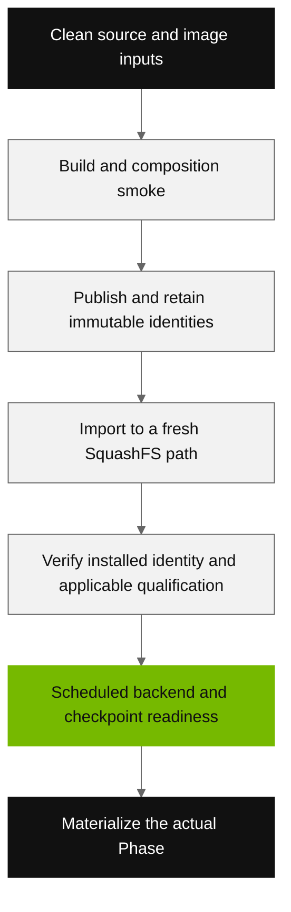

# Containers

Use the repository's common build, publish, and SquashFS import scripts. Images
bake Contract, Control, and Runtime wheels from a clean committed checkout;
execution uses those installed wheels by default. See the
[container overview](../../containers/README.md),
[preprocessing image](../../containers/preprocessing/README.md), and
[folding image matrix](../../containers/folding/README.md) for their exact pins.

## Choose the image family

| Image | Role | Detailed instructions |
| --- | --- | --- |
| `preprocessing` | ColabFold/MMseqs MSA generation and archive handling | [Preprocessing](../../containers/preprocessing/README.md) |
| `folding-runtime` | Non-fold actions, including MSA preparation and canonical reduction | [Runtime](../../containers/folding/runtime/README.md) |
| `folding-bioir` | BioIR scientific fold action | [BioIR](../../containers/folding/bioir/README.md) |
| `folding-colabfold` | ColabFold scientific fold action | [ColabFold](../../containers/folding/colabfold/README.md) |
| `folding-openfold-cli` | OpenFold scientific fold action | [OpenFold](../../containers/folding/openfold-cli/README.md) |
| `postprocessing` | Public toolkit and postprocessing Runtime | [Postprocessing](../../containers/README.md#postprocessing-variant) |

These shipped definitions target `linux/amd64`; the folding builders explicitly
select that platform. Check the actual execution node's architecture and the
built image architecture before deployment. A working NVIDIA driver alone does
not make an x86-64 image usable on an ARM node. This release does not supply an
ARM build or a profile switch that ports these images.

```bash
docker image inspect bspp-orchestration:folding-bioir \
  --format '{{.Os}}/{{.Architecture}} {{.Id}}'
```

## Build and publish

Build on a machine with Docker, Git, uv, jq, and the dependencies required by the
selected builder. Wheel builds use uv's offline build path, so its build
dependencies must already be cached. Keep generated run data and operator
configuration outside the checkout: builders refuse dirty or untracked source.

For BioIR folding, build both the executor and scientific images from the same
source revision:

```bash
containers/scripts/build.sh folding runtime
containers/scripts/build.sh folding bioir
containers/folding/runtime/smoke-local.sh bspp-orchestration:folding-runtime
containers/folding/bioir/smoke-local.sh bspp-orchestration:folding-bioir
```

Publish to your registry after configuring its normal external authentication:

```bash
export BSPP_REGISTRY=registry.example.com
export BSPP_IMAGE_REPOSITORY=team/bspp-release
containers/scripts/push.sh folding runtime
containers/scripts/push.sh folding bioir
```

`push.sh` builds again. Retain the resulting per-image `dist/build-record.json`
and smoke the exact newly built image ID after publication, rather than treating
an earlier local smoke as evidence for the pushed bytes. The same common
interface accepts `preprocessing` and `postprocessing` targets.

Record the clean source commit, image lock hash, wheel hashes, Docker image ID,
registry OCI digest, and eventual SquashFS SHA-256. These identify different
objects and are not interchangeable. Tags are mutable transport names. The
folding Runtime's pixi environment is resolved during the build rather than
from a committed pixi lock; pinned top-level inputs do not imply that every
transitive package is independently locked. Retain installed composition when
comparing separate builds.

## Import on the cluster

Import is a scheduled CPU operation. Set the site's account and partition and
use a new versioned output path for each image:

```bash
export BSPP_REGISTRY=registry.example.com
export BSPP_IMAGE_REPOSITORY=team/bspp-release
export CONTAINER_IMAGE=/data/bspp/images/folding-bioir-release-1.sqsh
sbatch --account=my-account --partition=cpu-short \
  containers/scripts/pull-sqsh.sh folding-bioir
```

Run from the matching repository checkout on the cluster. Repeat for
`folding-runtime` with a different `CONTAINER_IMAGE`. The importer removes an
existing file at its destination; never point it at an image used by an active
or retained run. Preserve failed attempts and select a fresh destination for a
retry.

The importer defaults to four CPUs, 32 GiB, and one hour; override Slurm resources
when the image or site's import tools need more. It places Enroot temporary and
cache files under job-local temporary storage by default. Verify capacity and
filesystem support for extraction and whiteouts. Registry credentials belong in
the site's external Enroot credential configuration, with a host entry matching
the actual import endpoint. `BSPP_REGISTRY_IMPORT` can select a site-supported
import endpoint separately from the push endpoint.

Retain the import log and hash the finished SquashFS. Compare its installed
manifest with the intended build record and verify the registry digest around
the tag-based import. Do not infer exact image identity from a successful pull
or a filename alone.

## Qualification and scientific readiness



For preprocessing, stage the source bundle and populate the profile from the
actual records before qualification:

```bash
bsppctl --config /path/to/profiles.yaml runtime preprocessing stage-source-bundle \
  --profile my-cluster --source-repo /path/to/clean-checkout \
  --build-dir /path/to/new-bundle-build
bsppctl --config /path/to/profiles.yaml runtime preprocessing qualify \
  --profile my-cluster --source-repo /path/to/clean-checkout
```

After that job completes, use `runtime preprocessing resolve` with the same
profile and source arguments to collect the genuine qualification. Generic
`runtime qualify` / `runtime resolve` serve the separate toolkit qualification
path; they are not substitutes for a folding model inference check.

Qualification and local smokes have specific scopes. The preprocessing smoke
tests packaging and tiny native conversion/assembly operations, not a full GPU
database search. BioIR's CPU smoke checks imports and Python extension building;
it does not initialize CUDA or load a checkpoint. Even basic CUDA operations do
not prove checkpoint compatibility. Exercise the selected backend, weights,
driver, mounts, and GPU allocation on a small scheduled workload before a large
run, retaining its real evidence.

Keep the executor and scientific images' source provenance consistent. Canonical
reduction writes evidence from its own installed Runtime environment. Source
mounts are an explicit development mode, not the default production mechanism;
do not patch an installed image while continuing to claim its previous identity.
