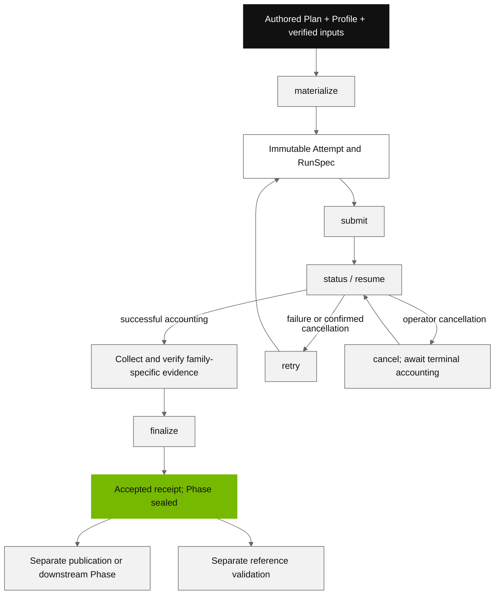

# Run a phase through its lifecycle

Use the public `bsppctl phase` commands to preserve input identity, scheduler
assignments and evidence across an attempt. Start with an authored Phase Plan,
an installed image and a site-specific Cluster Profile; the
[configuration reference](../reference/configuration.md) links the complete
public examples. See [release status](../status.md) for supported routes and
current limitations.



This is a conceptual workflow, not a list of serialized state enum values.
`status` observes; `resume` records one bounded reconciliation. Neither an
empty queue nor a missing accounting field proves success.

## Prepare inputs and qualification

Keep a clean committed source checkout matching the packages in your image.
Use the [container guide](containers.md)
for canonical build/import procedures. Record actual image and asset identities.

Preprocessing requires the exact Source Bundle and runtime qualification:

```bash
bsppctl --config "$profiles" runtime preprocessing stage-source-bundle \
  --profile "$profile" --source-repo "$source_repo"
# Pin the returned source identity and the measured image/build identities
# in the authored profile before continuing.
bsppctl --config "$profiles" runtime preprocessing qualify \
  --profile "$profile" --source-repo "$source_repo"
# After the scheduled smoke completes:
bsppctl --config "$profiles" runtime preprocessing resolve \
  --profile "$profile" --source-repo "$source_repo"
```

Here and below, shell variables are placeholders you must set to real authored
inputs or returned records. These commands do not generate model checkpoints,
Database Set declarations or accepted upstream artifacts for you. Governed
Runtime qualification uses the separate `runtime qualify` / `runtime resolve`
pair; SSH qualification also needs its staged `--source-package-identity`.
Postprocessing pins its genuine qualification record in the Phase Plan.
Qualification success is not proof of successful model inference.

## Materialize and inspect

```bash
bsppctl --config "$profiles" phase materialize "$phase_plan" \
  --authority-root "$authority_root" --source-repo "$source_repo" \
  > materialized.json
```

Use the returned `phase_run_id` in subsequent commands. Materialization creates
an immutable RunSpec, rendered action scripts and input/provenance bindings; it
does not submit scheduler work. It can stage or verify inputs. Inspect the
selected image, filesystem mounts, resources and dependencies before dispatch.
Preserve the whole authority directory and keep copied evidence outside it.
Do not edit generated RunSpecs or events to change a materialized attempt.

## Submit, observe and reconcile

```bash
bsppctl --config "$profiles" phase submit "$phase_run_id" \
  --authority-root "$authority_root" > submitted.json
bsppctl phase status "$phase_run_id" \
  --authority-root "$authority_root" --format json
bsppctl phase resume "$phase_run_id" --authority-root "$authority_root"
```

Submission records actual scheduler assignments. Retain its output and errors;
after a lost response, inspect authority before starting another operation.
`resume` is one reconciliation cycle, not a background monitor. Repeat it as
accounting changes, using the same authority. For packed folding it records the
assigned fold array's exact child outcomes; a parent row alone cannot establish
success. Capture terminal accounting promptly if your scheduler removes job
records quickly.

The profile transport is separate from scientific intent. `ssh` runs scheduler
commands through the named endpoint; `local-slurm` runs them on the Control host
and must omit `ssh_target`. A connection problem is not evidence that a job was
never submitted.

## Collect the correct handoff

Finalization requires successful durable accounting and matching Runtime
evidence. The collection path depends on the phase:

| Phase | Evidence preparation |
| --- | --- |
| Preprocessing | Preserve the Runtime's exact four-file handoff, its action evidence and an actual successful scheduler record. There is no preprocessing `phase evidence fetch` or scheduler-export command. |
| Folding, legacy | Preserve the aggregate action evidence and actual successful canonical-pair scheduler record. |
| Folding, `artifact-backed-v2` | After `resume`, use `phase evidence fetch` for indexed metadata, then provide genuine canonical-pair scheduler evidence. |
| Postprocessing | Use `phase evidence fetch` and `phase evidence export-scheduler`, or let the postprocessing coordinator do both. |

A preprocessing handoff contains `artifact-set.json`,
`artifact-location.json`, `content-validation.json`, and
`chunks/<actual-chunk-stem>.json`. Copy the original successful records without
rewriting their paths, hashes or identities. Keep tar/LZ4 payloads available at
the locations their descriptors identify; metadata transfer is not payload
transfer.

For preprocessing/folding, the caller-supplied scheduler file must satisfy
[`ProvidedSuccessfulSchedulerEvidence`](../../packages/orchestration-contract/src/bspp/orchestration/contract/phase_receipt.py)
and match the assigned job's genuine `sacct` terminal success and durable
authority. Use the actual recorded values through that Contract API; this guide
does not supply a fabricated successful JSON template. Folding uses the terminal
canonical-pair action's scheduler record, after upstream action/array success.

For artifact-backed folding, use actual action IDs from the sealed RunSpec:

```bash
mkdir -p "$evidence_parent"
bsppctl phase evidence fetch "$phase_run_id" \
  --authority-root "$authority_root" --destination "$bundle"
bsppctl phase finalize "$phase_run_id" --authority-root "$authority_root" \
  --scheduler-evidence "$scheduler_evidence" --handoff "$bundle" \
  --action-evidence "$bundle/$canonical_action_id/action-evidence.json"
```

`$bundle` must be a new directory under the existing `$evidence_parent`.
`$scheduler_evidence` must already contain the genuine typed record described
above. Fetch validates the bounded four-metadata-file bundle and its finalization
index. It does not fetch prediction structures or full score matrices; preserve
those originals separately when auditing results.

For other families, use the required flags in the
[finalization reference](../reference/bsppctl.md#finalization-inputs).
Postprocessing additionally requires the fetched acceptance adjudication. Its
restart-safe `phase run-postprocessing` coordinator can drive the entire
materialize-to-finalize sequence with a separate `--execution-root`.

## Acceptance, downstream inputs and publication

A successful `finalize` returns `status: accepted` and a receipt bound to the
Attempt, RunSpec, assigned job and validated evidence. It seals the Phase Run.
Acceptance does not upload artifacts or run the folding benchmark judge.

To consume an MSA handoff that lacks producer-attested member lengths:

```bash
bsppctl --config "$profiles" legacy-msa-import --handoff-root "$handoff" \
  --output-dir "$enriched" --profile "$profile"
```

Both `$handoff` and `$enriched` are cluster-resident directories. This schedules
a real import job, verifies payloads and creates enriched metadata without
modifying the original bundle. The command returns IDs and lengths; retain the
three original enriched JSON records from `$enriched` separately from the
unchanged chunk manifest. Use those verified identities when authoring a folding
Plan. See the [BioIR walkthrough](../benchmarks/bioir-workflow.md#4-accept-and-enrich-the-real-msa-handoff)
for the exact handoff layout and transfer boundary.

Publication is explicit: `phase publish-preprocessing` or `phase publish-folding`
uses the declared transport and actual bundles. Both require `--profile NAME`
matching the materialized RunSpec. They submit a CPU Slurm job in the imported
Runtime container, upload cluster-resident archives, and return the small upload
evidence to the local `--evidence-dir`. Supply the profile's `control_cpu`
resources and AWS file mounts. See the
[publication command reference](../reference/bsppctl.md#publication-and-seam-derivation)
for declaration paths and required arguments. A separate
`release approve-publication` validates release evidence and writes approval;
that command alone does not transfer data.

Reference-coordinate assessment is also separate. The current `validate-run`
requires a pinned **S3** corpus, AWS file mounts and cluster-resident run/suite/
index paths. It reports C-alpha RMSD and gates identity, score validity and
coordinate coverage, not an RMSD accuracy threshold. A Phase Receipt by itself
does not establish reference-validation success.

## Cancellation and Retry

```bash
bsppctl phase cancel "$phase_run_id" --authority-root "$authority_root"
bsppctl phase resume "$phase_run_id" --authority-root "$authority_root"
# Only after durable failure or accounting-confirmed cancellation:
bsppctl --config "$profiles" phase retry "$phase_run_id" \
  --authority-root "$authority_root" --source-repo "$source_repo"
```

Cancellation remains pending until conclusive terminal accounting. Retry creates
a fresh immutable Attempt/workspace; it does not submit. Submit the same Phase
Run ID's newly current Attempt after reviewing the
returned successor. Do not treat automatic Slurm requeue as permission to reuse
a partial workspace.

Preprocessing can opt into `--carry-forward FILE` for verified A3M members.
Folding verifies rank journals itself and derives carry-forward automatically;
the successor still uses the complete planned array. Preserve failed outputs
and their evidence. Changes to frozen scientific inputs, BioIR model/checkpoint
policy or incompatible kernel action parameters require a fresh Phase rather
than editing or forcing Retry.
