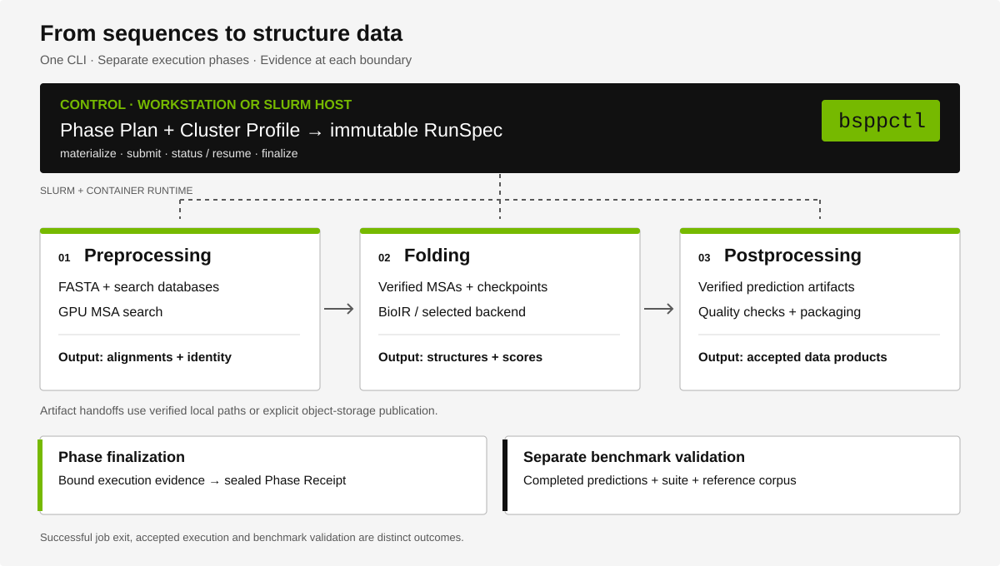

# Documentation

The BioNeMo Structure Prediction Pipeline exposes its orchestration through
`bsppctl`. A workstation Control Plane prepares and manages execution;
containerized Runtime jobs perform scientific work on a Slurm cluster.

## Choose a starting point

| Goal | Read next |
| --- | --- |
| Install the CLI and reconstruct the public benchmark | [Quickstart](quickstart.md) |
| Run the BioIR benchmark | [BioIR benchmark walkthrough](benchmarks/bioir-workflow.md) |
| Configure a cluster and its storage | [Cluster configuration](guides/cluster-configuration.md) |
| Build and qualify execution images | [Containers](guides/containers.md) |
| Submit, inspect, reconcile or recover a Phase | [Phase lifecycle](guides/phase-lifecycle.md) |
| Understand what this release supports | [Implementation status](status.md) |

## User guides

- [Installation](guides/installation.md): Control dependencies, Runtime dependencies and lock handling.
- [Cluster configuration](guides/cluster-configuration.md): transport, resources, paths and mounts.
- [Containers](guides/containers.md): build, publish, import and qualification.
- [Phase lifecycle](guides/phase-lifecycle.md): immutable Attempts and evidence-backed completion.
- [Troubleshooting](guides/troubleshooting.md): observable symptoms and supported recovery steps.

## Reference and examples

- [CLI reference](reference/bsppctl.md): command families, arguments and phase-specific boundaries.
- [Configuration reference](reference/configuration.md): Plan, Profile, RunSpec and artifact identities.
- [Example catalog](examples/README.md): the canonical commented YAML templates and transport examples.

Run repository-relative commands from the repository root unless a page says
otherwise. Paths such as `/path/to/...` and names such as `my-cluster` are
operator-supplied placeholders. Never replace a checksum or accepted receipt
with an illustrative value merely to make a Plan parse.

## Benchmarking

- [Public dataset](benchmarks/pdb-temporal-2022-2025-v1/README.md): 750 monomers and 250 complexes, reconstructed from public sources.
- [BioIR workflow](benchmarks/bioir-workflow.md): preparation, inference, finalization and validation.
- [Measurement methodology](benchmarks/methodology.md): timing boundaries, parallelism and GPU-hours.
- [Reporting guidance](benchmarks/reporting.md): how to document measurements and validation outcomes.

Public reconstruction, scheduler completion, Phase acceptance and benchmark
validation establish different facts. Each guide names the evidence required
at that boundary. Read [status and limits](status.md) before interpreting a
successful command as an end-to-end release qualification.

## Architecture and contribution

The [architecture catalog](architecture/README.md) links the existing pipeline,
database-placement and publication designs. Agent workflows in
[skills](../skills/) reference the same user guides and examples.

Documentation changes should accompany changes to command flags, configuration
or execution behavior. See [DEVELOPING.md](../DEVELOPING.md) for the public
contribution surface and repository checks.
