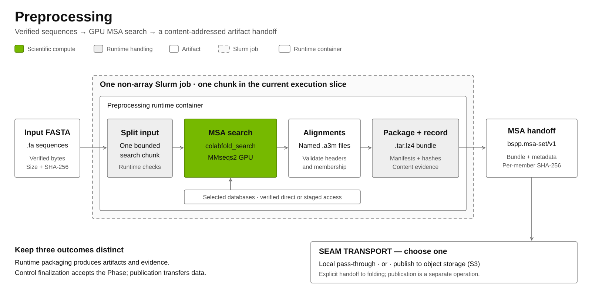
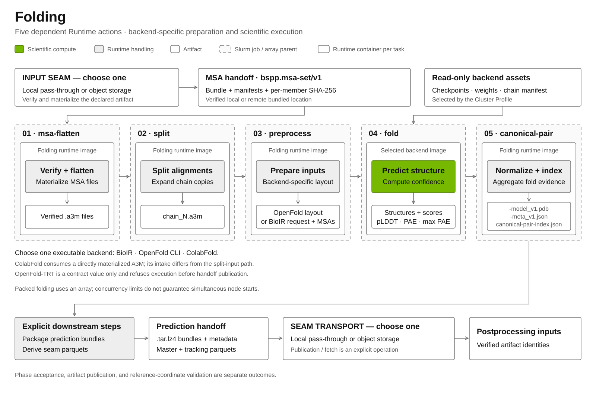
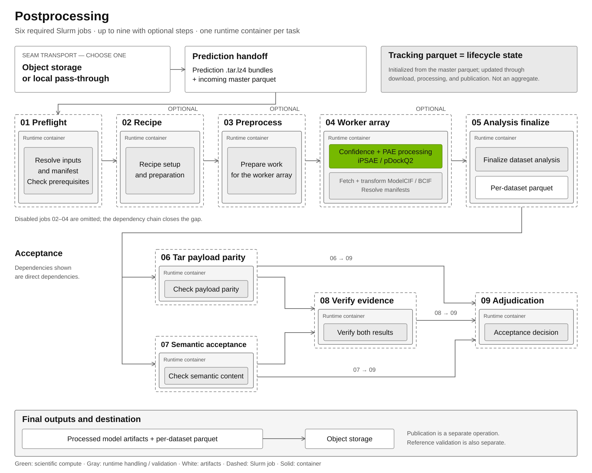
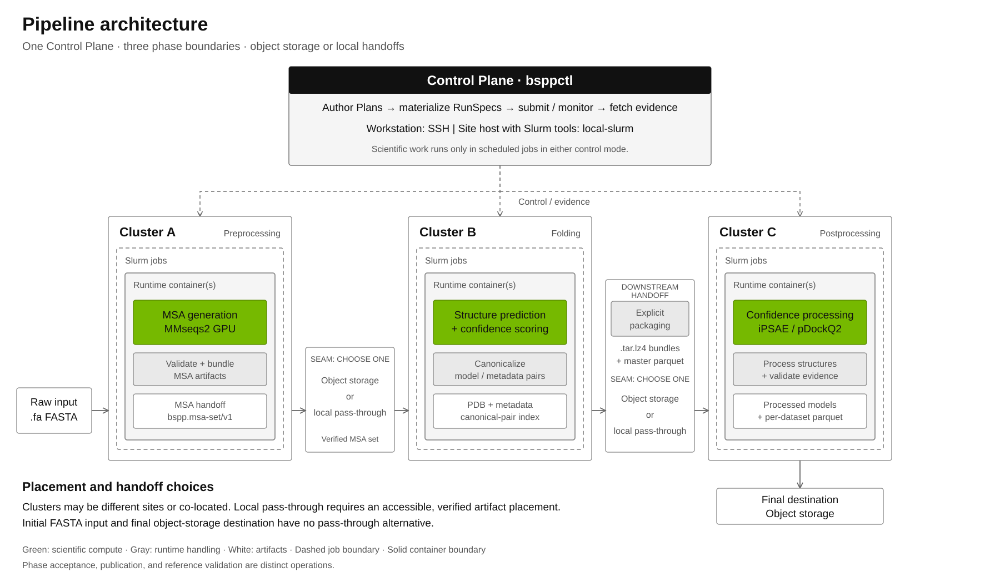

# BSPP Pipeline Overview

[Documentation index](index.md) · [Implementation status](status.md) · [BioIR workflow](benchmarks/bioir-workflow.md)

`bspp-orchestration` runs the AFDB-scale protein-structure pipeline as three
phases — **preprocessing**, **folding**, and **postprocessing** — orchestrated
from one Control Plane CLI (`bsppctl phase`). Each phase is an evidence-first
lifecycle: a Phase Plan is materialized into an immutable Phase RunSpec, executed
as Slurm Runtime Actions inside a container, and closed with indexed evidence and
a Phase Receipt. Data flows between phases through the phase-seam transport
policy: each seam is either published to **object storage** or passed
through **locally**, so the same pipeline runs across one cluster or three.

## How to read the diagrams

Open a diagram to view it at full size. The three phase diagrams share one
visual language:

- **White box** — a data artifact or format at a seam.
- **NVIDIA green box** — scientific compute (the swappable scientific step).
- **Gray box** — runtime data handling / packaging / validation.
- **Dashed rounded rectangle** — one Slurm job (one submitted parent; an array
  may run many tasks inside it).
- **Solid rounded rectangle** — the runtime container for that phase.
- **"SEAM TRANSPORT — CHOOSE ONE"** — the phase seam: **object storage** or
  **local pass-through**. The per-seam policy is authored on the
  preprocessing or folding Phase Plan (`payload.transport`). The initial `.fa`
  input and the final destination have no pass-through alternative.

## Preprocessing

[](assets/pipeline/preprocessing.svg)

- **Slurm jobs** — one non-array job (the current slice is a single chunk).
- **Container** — `preprocessing runtime container`.
- **Data formats** — `.fa` FASTA → `.a3m` → `.tar.lz4` → `bspp.msa-set/v1`
  (content-addressed: a root manifest plus per-member SHA-256 digests and
  content-validation evidence).
- **Scientific content** — MSA generation via `colabfold_search` (MMseqs2 GPU).
- **Swap points** — the container image at the Slurm job boundary, and the seam
  transport (object storage or local pass-through).

## Folding

[](assets/pipeline/folding.svg)

- **Slurm jobs** — five Runtime Actions in a fixed graph
  (`msa-flatten → split → preprocess → fold → canonical-pair`). Executable
  runtime composition is landed: each action invokes the job-local Runtime
  executor (`python -m bspp.orchestration.runtime.folding.executor`).
  `openfold-cli`, `colabfold`, and `bioir` are executable; `openfold-trt` is
  an accepted contract value that fails closed before handoff/evidence
  publication. See [implementation status](status.md) for execution limits and
  [reporting guidance](benchmarks/reporting.md) for documenting live acceptance scope.
- **Container** — `folding runtime container` (four images: one runtime image
  for non-fold actions plus three per-backend kernel images for the fold
  action).
- **Data formats** — `bspp.msa-set/v1` → `chain_N.a3m` → prepared inputs
  (`openfold` layout: `fasta/`, `alignments/`, `templates/`; `bioir` layout:
  `bioir-request.json`, `layout.json`, `alignments/polymer_NN/*.a3m`) →
  `-model_v1.pdb` + `-meta_v1.json` (`plddt` / `pae` / `max_pae`) and
  `canonical-pair-index.json`. Downstream `.tar.lz4` bundles and a master
  parquet require explicit packaging; they are not produced automatically by
  the five-action graph.
- **Scientific content** — structure prediction and confidence scoring.
- **Swap points** — the folding backend (`payload.backend`), chosen from four
  alternatives: **`openfold-cli`**, **`bioir`**, **`colabfold`**, or
  **`openfold-trt`** (the exact `tool_used` strings are `ColabFold v1.6.0 /
  AlphaFold-Multimer`, `OpenFold-TRT / AlphaFold-Multimer`, `OpenFold /
  AlphaFold-Multimer`, and `OpenFold2 (BioNeMo IR) / AlphaFold-Multimer`).
  `openfold-cli`, `colabfold`, and `bioir` are executable; `openfold-trt`
  fails closed before handoff/evidence publication. External
  backend assets — the chain-manifest CSV (`openfold-cli` and `colabfold`),
  the OpenFold model dir (`openfold-cli`), the ColabFold weights dir
  (`colabfold`), and the BioIR `.pt` checkpoint (`bioir`) — resolve from the
  Cluster Profile `folding_backend_assets` into a typed
  `FoldingBackendAssetsSnapshot` stored in Attempt authority; each selected
  asset path must be covered by an exact read-only `extra_mounts` target
  rendered as Pyxis `:ro`. The chain-manifest CSV is an
  external reference input that supplies the UniProt
  accession mapping (folding preserves only the `AF-<16-digit>` model ID); it
  maps `model_entity_id` → `entity_id` → `chain_id` → `uniprot_ac` and drives
  leaked-homodimer classification. ColabFold is the one
  asymmetric intake: it consumes a directly materialized A3M via
  `colabfold_batch` rather than the msa-set → split path. The
  per-seam transport policy (`payload.transport`) selects
  `publish-to-s3` or `local`; publication and fetch are an
  explicit operator/runtime handoff using the seam-transport utilities.

## Postprocessing

[](assets/pipeline/postprocessing.svg)

- **Slurm jobs** — six required, up to nine when optional steps are enabled.
- **Container** — `postprocessing runtime container`.
- **Slurm action topology** — the maximal chain is `01 preflight → 02 recipe →
  03 preprocess → 04 worker array → 05 analysis finalize`, with optional jobs
  02–04 omitted by closing the chain. Acceptance then forks from 05 to jobs 06
  (tar payload parity) and 07 (semantic acceptance); job 08 (verify evidence)
  depends directly on both 06 and 07; job 09 (acceptance adjudication) depends
  directly on 06, 07, and 08.
- **Data formats** — prediction bundles → confidence + PAE JSONs and
  ModelCIF/BCIF structures → per-dataset parquet manifest. The tracking parquet
  is not an aggregate: it is lifecycle state initialized from the incoming
  master parquet and updated through download, processing, and publication.
- **Scientific content** — confidence scoring (`iPSAE` / `pDockQ2`).
- **Swap points** — the seam transport (object storage or local pass-through in;
  object storage as the final destination out). This phase is frozen relative to
  the folding work and is not modified here.

## Run Plans

Each phase is driven by a user-authored Phase Plan, which is materialized into an
immutable Phase RunSpec. The blocks below are **conceptual sketches, not loadable
Phase Plans** — they show the key fields per phase and where each maps to the
diagram above; the authoritative field surface lives in the contract package
(`contract/phase.py` for preprocessing/folding, `contract/postprocessing_plan.py`
for postprocessing). Folding reuses the generic Phase lifecycle,
so its Phase Plan and Phase RunSpec are folding-typed records dispatched through
the same `bsppctl phase` surface.

### Preprocessing

```yaml
schema_version: 1
phase_kind: preprocessing          # which phase this plan drives
target_cluster: <cluster-id>       # Cluster Profile (transport, account, partition)

input_location:                    # -> "Raw input .fa FASTA"
  kind: verified-local-file
  path: queries.fa                 # verified local file
  sha256: <64-hex>                 # pinned; re-verified at materialization
  size_bytes: <int>

payload:                           # phase payload
  work_plan: {...}                 # -> "Split input" (bounded one-chunk work plan)
  chunk_execution_intent: {...}    # -> "MSA search" (bounded execution intent)
  database:                        # -> "MSA search (colabfold_search, MMseqs2 GPU)"
    database_set:
      identifier: bspp-search     # installed via Database Placement
      version: <version>
    requested_policy: stage-required
  transport: local                 # local | publish-to-s3
  # s3_publish_prefix: s3://<bucket>/<prefix>  # required for publish-to-s3
```

- `input_location` — the one verified `.fa` FASTA the phase searches.
- `payload.work_plan` / `payload.chunk_execution_intent` — the bounded one-chunk
  work plan and execution intent (the current slice is a single chunk).
- `payload.database` — the MMseqs2 search database set (identifier/version plus
  access policy) used by `colabfold_search`.
- The container image is resolved from the Cluster Profile (`runtime_image`), not authored here.
- `payload.transport` selects local handoff (the default) or `publish-to-s3`;
  the latter also requires `payload.s3_publish_prefix`. Publication is an
  explicit scheduled step through `bsppctl phase publish-preprocessing`, not
  an automatic consequence of finalization. The consuming folding Phase Plan
  also records its seam-transport policy.

### Folding

```yaml
schema_version: 1
phase_kind: folding                # which phase this plan drives
target_cluster: <cluster-id>       # Cluster Profile (transport, account, partition)

input_location:                    # -> "MSA handoff bspp.msa-set/v1"
  kind: verified-remote-bundled    # or verified-local-bundled
  artifact_set_id: sha256:<64-hex>
  bundle_uri: s3://<prefix>/<lz4-sha256>.tar.lz4
  # ... tar/lz4 sizes + SHA-256, raw_tar_members, members, verified_at

payload:                           # phase payload
  msa_set:                         # -> the consumed bspp.msa-set/v1
    artifact_type: bspp.msa-set/v1
    artifact_set_id: sha256:<64-hex>
    expected_chunk_count: 1
    member_a3m_paths: [a3ms/...]
    requires_paired_query_header: true
  backend: openfold-cli            # -> "FOLD — CHOOSE ONE" (one of four)
  #   openfold-cli | bioir | colabfold | openfold-trt
  transport: publish-to-s3         # -> "SEAM TRANSPORT — CHOOSE ONE"
  #   publish-to-s3 | local
```

- `input_location` — the verified `bspp.msa-set/v1` Artifact Set from the
  previous phase (local or remote bundled location).
- `payload.msa_set` — the consumed MSA set (`MsaSetConsumption`).
- `payload.backend` — which of the four folding backends to run.
- `payload.transport` — the per-seam transport policy:
  `publish-to-s3` or `local`.
- The container/kernel image is resolved from the Cluster Profile (`paths.image`),
  not authored here. Per-backend image selection (`folding_backend_images`) and
  the external backend assets (`folding_backend_assets` → a typed
  `FoldingBackendAssetsSnapshot`, read-only mounted into the job) are wired;
  the chain-manifest CSV, model/weights dirs, and BioIR checkpoint are
  container-visible asset paths, never Phase Plan fields.

### Postprocessing

```yaml
schema_version: 1
phase_kind: postprocessing         # which phase this plan drives
target_cluster: <cluster-id>       # Cluster Profile

output_namespace: example-phase    # attempt-scoped output namespace

legacy_run_plan:                   # -> the pinned legacy Run Plan (worker/analysis/validation)
  document_kind: legacy-run-plan
  path: run-plan.yaml
  sha256: <64-hex>
  size_bytes: <int>
acceptance_policy: {...}           # -> acceptance residual/report policy
logical_input_inventory: {...}     # -> "Prediction handoff" input identities
runtime_qualification: {...}       # -> the promoted runtime qualification record
```

- The postprocessing Phase Plan pins four authority documents by exact bytes:
  the legacy Run Plan (which carries the worker stages, `pdockq2_threshold`,
  validation, and acceptance settings), the acceptance policy, the
  logical-input inventory (the prediction-handoff input identities), and the
  runtime qualification record.
- `output_namespace` scopes the Attempt output root; the authored
  `dataset.name` tracking selector and relative output suffixes are preserved
  from the pinned legacy Run Plan.
- The final destination is object storage; postprocessing is frozen relative to
  the folding work and is not modified here.

## Architecture

[](assets/pipeline/architecture.svg)

The Control Plane uses SSH from a workstation or `local-slurm` from a site host
with Slurm tools. Scientific work runs in scheduled jobs in either mode:
authoring Phase Plans, submitting Slurm jobs, monitoring, and fetching evidence.
Each phase runs on a (possibly different) cluster inside Slurm jobs and runtime
containers. In the maximal three-cluster topology shown, data artifacts are
produced on the clusters and move between phases through the shared object
storage; co-located phases may instead use local pass-through.

## Composition and validation

The three phases compose through verified artifact handoffs. The public
`pdb-temporal-2022-2025-v1` corpus provides a 10-target smoke subset and the full
1,000-target suite. The [BioIR walkthrough](benchmarks/bioir-workflow.md) connects
public reconstruction, preprocessing and folding to the current validation
commands, including the manual evidence boundaries.

Phase acceptance, benchmark validation and publication are distinct results.
A successful execution gate does not establish experimental structural accuracy.
Use [implementation status](status.md) for the release's supported surfaces and
remaining limits, and [benchmark methodology](benchmarks/methodology.md) for
performance claims. Image locks pin build inputs; an executed report must also
identify the actual image, source, data, configuration and accepted evidence.
